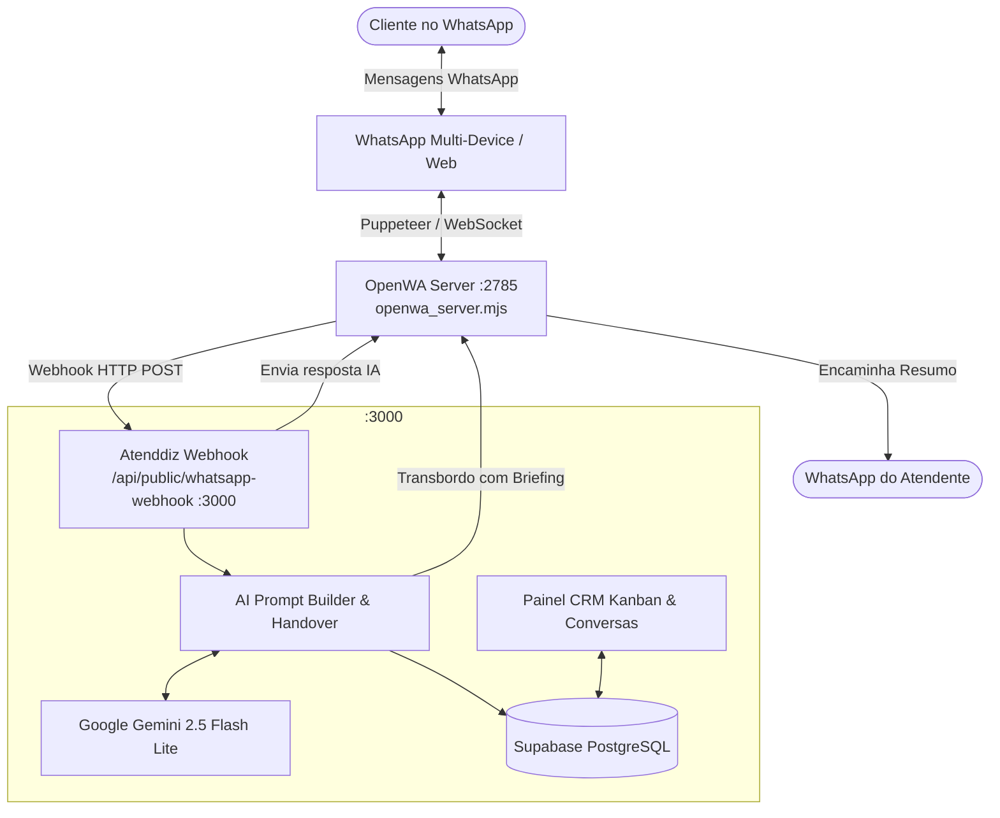

# Atenddiz

Plataforma de Atendimento Comercial Inteligente, CRM Kanban e Agente IA 24/7 no WhatsApp.

[](LICENSE)
[](https://nodejs.org/)
[](https://react.dev/)
[](https://vitejs.dev/)
[](https://github.com/open-wa/wa-automate-nodejs)
[](https://supabase.com/)
[](https://deepmind.google/technologies/gemini/)

Transforme seu WhatsApp em uma máquina de vendas e atendimento automatizado com inteligência artificial generativa, pipeline CRM Kanban interativo e transbordo humano inteligente.

---

## Sumário

- [Visão Geral](#visão-geral)
- [Principais Funcionalidades](#principais-funcionalidades)
- [Arquitetura do Sistema](#arquitetura-do-sistema)
- [Stack Tecnológica](#stack-tecnológica)
- [Estrutura do Repositório](#estrutura-do-repositório)
- [Guia de Instalação e Execução Local](#guia-de-instalação-e-execução-local)
- [Configuração de Variáveis de Ambiente](#configuração-de-variáveis-de-ambiente)
- [Executando em Produção com PM2](#executando-em-produção-com-pm2)
- [Solução de Problemas Frequentes](#solução-de-problemas-frequentes)
- [Licença e Direitos](#licença-e-direitos)

---

## Visão Geral

O **Atenddiz** é uma solução fullstack criada para empresas que desejam automatizar conversas no WhatsApp sem perder a humanização e a eficiência comercial.

Diferente de chatbots baseados em fluxos rígidos com menus numéricos, o Atenddiz utiliza **modelos de linguagem avançados (Google Gemini 2.5 Flash Lite)** integrados ao contexto em tempo real do negócio, catálogo de produtos, tabela de preços, horários de funcionamento e regras de negócio personalizáveis.

---

## Principais Funcionalidades

### 1. Agente IA com Modos Especializados

- **Modo Vendedor Ativo (Foco em Conversão):** Conduz o lead de forma persuasiva pelo funil de vendas, descobre dores e necessidades, apresenta produtos do catálogo e gera cobrança PIX imediata (com código Copia e Cola automático e QR code dinâmico).
- **Modo Assistente Receptivo (Foco em Suporte):** Tira dúvidas frequentes, orienta sobre políticas e horários de atendimento, priorizando acolhimento antes de encaminhar para a equipe.
- **Divisão Inteligente em Bolhas:** Opção de envio fragmentado (1 a 3 bolhas de mensagem) com pausas naturais, simulando uma conversa humana realista.
- **Pausa Automática por Intervenção Humana:** A IA pausa instantaneamente suas respostas quando um atendente assume a conversa pelo painel ou pelo WhatsApp.

### 2. Encaminhamento e Transbordo com Resumo Executivo (Briefing IA)

- **Briefing Executivo Automático:** Quando o cliente solicita atendimento humano ou fecha negócio, a IA compila em segundos um relatório estruturado:
  - Perfil e interesse do lead;
  - Pontos negociados e objeções identificadas;
  - Link direto (`wa.me`) para o atendente assumir a conversa com 1 clique.
- **Disparo no WhatsApp da Equipe:** O resumo é encaminhado diretamente para o número configurado do atendente ou supervisor.

### 3. CRM Kanban Multietapas em Tempo Real

- Visualização completa do pipeline de vendas (*Novos Leads, Em Atendimento, Aguardando Pagamento, Concluídos, Perdidos*).
- Arraste e solte de cartões (*Drag and Drop*) alimentado por `@dnd-kit`.
- Gaveta lateral (*Lead Drawer*) com histórico detalhado das conversas, campos personalizados, anotações internas e transbordo manual.

### 4. Painel de Conversas Unificado (Inbox Web)

- Interface idêntica ao WhatsApp Web moderna com suporte a temas.
- Visualização de mensagens de texto, notas de voz (com transcrição via IA), imagens e comprovantes de pagamento.
- **Copilot de Atendimento:** Botões para resumir a conversa com 1 clique e sugerir respostas personalizadas.

### 5. WhatsApp Gateway Nativo (OpenWA Server)

- Servidor WhatsApp Web nativo e independente via Puppeteer (`openwa_server.mjs`).
- Suporte nativo ao protocolo WhatsApp Multi-Device (MD), mapeando automaticamente IDs locais (`@lid`) para números telefônicos reais (`@c.us`).
- Auto-inicialização em segundo plano no arranque do sistema ou via orquestrador PM2.
- Bypass automático de restrições de envio, permitindo comunicação fluida com novos contatos.

---

## Arquitetura do Sistema



---

## Stack Tecnológica

| Camada | Tecnologia | Descrição |
| --- | --- | --- |
| **Frontend** | React 19, TanStack Router, TanStack Start | SPA/SSR moderno com roteamento type-safe |
| **Estilização** | Tailwind CSS v4, Radix UI, Lucide Icons | Design system moderno, responsivo e dark/light mode |
| **Backend** | TanStack Start Server Functions, Node.js | Rotas de API e funções server-side integradas |
| **Banco de Dados** | Supabase (PostgreSQL 15+) | Autenticação, Row Level Security (RLS) e Realtime |
| **WhatsApp Engine** | Node.js + `@open-wa/wa-automate` | Gateway WhatsApp na porta 2785 com Puppeteer headless |
| **Inteligência Artificial** | Google Gemini (2.5 Flash Lite) / Lovable AI | Geração de respostas, briefing de leads e transcrição de áudio |
| **Orquestração** | PM2 (`ecosystem.config.cjs`) | Gerenciamento de processos em ambientes de produção |

---

## Estrutura do Repositório

```text
Atenddiz/
├── openwa_server.mjs               # Servidor dedicado OpenWA (porta 2785)
├── ecosystem.config.cjs            # Configuração de deploy para PM2
├── package.json                    # Dependências e scripts de execução
├── vite.config.ts                  # Configuração do Vite e TanStack Start
├── src/
│   ├── config/
│   │   └── brand.ts                # Definição de marca e suporte
│   ├── components/
│   │   ├── crm/                    # Componentes do CRM Kanban e Lead Drawer
│   │   └── ui/                     # Componentes visuais reutilizáveis (Radix UI)
│   ├── integrations/
│   │   └── supabase/               # Clientes Supabase (browser e server-side)
│   ├── lib/
│   │   ├── ai-prompt.ts            # Engenharia de prompts da IA (Vendedor vs Assistente)
│   │   ├── lead-handover.server.ts # Geração de briefings e transbordo inteligente
│   │   ├── chat-copilot.functions.ts # Funções de copiloto e envio de resumos
│   │   ├── evolution.functions.ts  # Gerenciamento de conexão e teste de respostas
│   │   └── whatsapp-provider/      # Abstração de provedores WhatsApp (OpenWA)
│   └── routes/
│       ├── api/
│       │   └── public/
│       │       └── whatsapp-webhook.ts # Endpoint webhook de mensagens recebidas
│       └── app/
│           ├── agente.tsx          # Painel de configuração do Agente IA & PIX
│           ├── conversas.tsx       # Inbox estilo WhatsApp Web com Copilot
│           ├── crm.tsx             # Quadro Kanban de leads e negociações
│           └── conexao.tsx         # Leitura de QR Code e status do WhatsApp
└── supabase/
    └── migrations/                 # Migrações SQL e estrutura das tabelas
```

---

## Guia de Instalação e Execução Local

### Pré-requisitos

- **Node.js**: Versão 20.x ou superior (recomendado Node 22+)
- **NPM** ou **PNPM**
- **Navegador Chrome/Chromium** instalado (utilizado pelo OpenWA)
- Projeto no **Supabase** configurado com as migrações

### 1. Clonar o Repositório

```bash
git clone https://github.com/conddiz/atenddiz.git
cd atenddiz
```

### 2. Instalar as Dependências

```bash
npm install
```

### 3. Configurar o Arquivo `.env`

Copie o modelo de variáveis de ambiente e preencha as credenciais:

```bash
cp .env.example .env
```

### 4. Iniciar os Serviços

Para rodar em desenvolvimento, execute dois terminais:

#### Terminal 1 — Servidor WhatsApp (OpenWA)

```bash
npm run openwa
```

O servidor iniciará na porta `2785`.

#### Terminal 2 — Aplicação Web (Atenddiz Frontend + API)

```bash
npm run dev -- --port 3000
```

A aplicação estará disponível em `http://localhost:3000`.

---

## Configuração de Variáveis de Ambiente

Crie o arquivo `.env` na raiz do projeto com a seguinte estrutura:

```env
# Conexão Supabase
VITE_SUPABASE_URL="https://seu-projeto.supabase.co"
VITE_SUPABASE_ANON_KEY="sua-chave-anon"
SUPABASE_SERVICE_ROLE_KEY="sua-chave-service-role"

# Provedor do WhatsApp (padrão: openwa)
WHATSAPP_PROVIDER="openwa"

# OpenWA Server Local
OPENWA_API_URL="http://localhost:2785"
OPENWA_API_KEY=""

# Provedor de IA (Gemini ou OpenAI)
OPENAI_API_KEY=""
```

---

## Executando em Produção com PM2

Para rodar em servidores VPS (Ubuntu, Debian, Windows Server) com auto-reinicialização em caso de falhas:

### 1. Instalação Global do PM2

```bash
npm install -g pm2
```

### 2. Iniciar os Processos

Inicie os processos através do arquivo `ecosystem.config.cjs`:

```bash
npm run prod:start
```

### 3. Verificar o Status dos Serviços

```bash
pm2 status
```

### 4. Acompanhar os Logs em Tempo Real

```bash
pm2 logs
```

---

## Solução de Problemas Frequentes

### 1. Porta 2785 já está em uso (EADDRINUSE)

Se o processo do OpenWA já estiver em execução em segundo plano:

No Windows (PowerShell):

```powershell
Get-NetTCPConnection -LocalPort 2785 | Select-Object OwningProcess
Stop-Process -Id <PID_ENCONTRADO> -Force
```

No Linux:

```bash
fuser -k 2785/tcp
```

### 2. Mensagem não envia para números sem conversa aberta

O servidor OpenWA integrado já possui a correção nativa para resolução de contas Multi-Device (`WAWebQueryExistsJob`) e contorna o bloqueio de números não salvos, garantindo que qualquer número com DDD válido receba mensagens normalmente.

### 3. QR Code não aparece na tela de Conexão

Certifique-se de que o `openwa_server.mjs` está rodando e acessível na URL configurada em `OPENWA_API_URL` (`http://localhost:2785`).

---

## Licença e Direitos

Distribuído sob a licença **MIT**. Consulte `LICENSE` para mais detalhes.

Desenvolvido para máxima performance comercial pela equipe **Atenddiz**.
